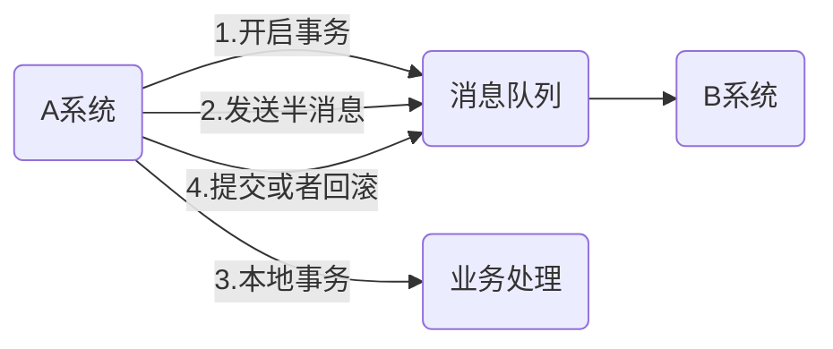

# RocketMQ 基础

## RocketMQ 解决并行消费生产

几乎所有的消息队列消息发送成功和消费成功都是通过请求-确认模式来确保消息是否发送成功的，这个就带来了一个问题，在某一条消息被消费成功之前，下一条消息是不能被消费的，否则就会引起消息空洞，违背了有序性的原则。就是说每个 topic 在任意时刻，最多只能有一个消费者实例在进行消费，这就没办法通过水平扩展消费者的数量来提升消费端总体的性能。RocketMQ 是通过引入队列的方式解决消费端无法水平扩展的问题，从而通过多个队列来实现并行生产和消费。但是这个就出现了另外一个问题，RocketMQ 只能保证队列层次上的有序性，无法保证 topic 层次的严格有序。

## RocketMQ 订阅模式实现

RocketMQ 订阅模式是通过消费组来实现的，每个消费组都消费 topic 中的一份完整的消息，不同消费组之间消费进度不受影响，同一条消息被 Consumer Group1 消费过，也会再给 Consumer Group2 消费。
同一个消费组内的多个消费者是竞争关系，一条消息只能被一个消费组内的一个消费者消费。
那么对于订阅消息，是如何消息一条消息可以被不同的消费者组消费的呢？
我们最容易想到的方法是每个消息每个消费组都保留一份，但是这样会造成空间的极大浪费。RocketMQ 是怎么解决的呢？RocketMQ 是在每个消费组每个队列上维护一个消费位置即 Consumer Offset
,每消费成功一条消费位置就会加一。

## RocketMQ 实现分布式事务

RocketMQ 的事务是通过先发送到 MQ 服务器一个半消息，
